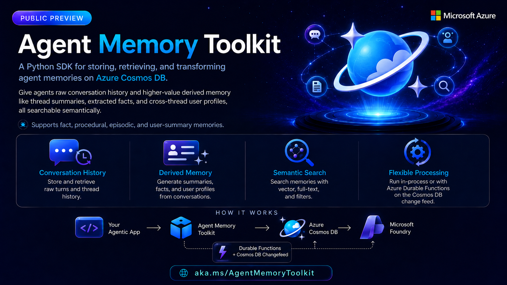

# Azure Cosmos DB Demo

This folder contains the Cosmos DB demo for **BRK223 - From rows to reasoning: Designing databases for AI apps and agents**. The demo shows how an AI support agent can use Azure Cosmos DB as a durable memory layer, keeping customer context available across tickets while preserving isolation between users.

## Demo Overview

The included [Support Engineer Agent](Support_Engineer_Agent/README.md) is a developer-facing sample built around the [Agent Memory Toolkit](https://github.com/azurecosmosdb/AgentMemoryToolkit). It demonstrates a support workflow where the agent can:

- Store raw support conversations in Azure Cosmos DB.
- Retrieve semantically relevant memories from previous tickets.
- Use extracted facts, thread summaries, and user profiles to personalize responses.
- Keep each customer's memory separate while still allowing cross-ticket continuity for that customer.
- Expose the memories that influenced an answer so developers can inspect the reasoning context.

The sample is seeded with multiple support customers and issues, including device management, API reliability, Cosmos DB query performance, and security/compliance scenarios.

## Agent Memory Toolkit

[Agent Memory Toolkit](https://github.com/azurecosmosdb/AgentMemoryToolkit) is a Python SDK for storing, retrieving, and transforming agent memories on Azure Cosmos DB. It gives an agent access to both raw conversation history and higher-value derived memory, including thread summaries, extracted facts, and cross-thread user profiles. These memories are searchable semantically, so the agent can retrieve relevant context without relying only on the current conversation.

The toolkit's processing pipeline can run in-process for a zero-infrastructure local setup, or in a sibling Azure Durable Functions app that watches the Azure Cosmos DB change feed. It provides matching sync and async client APIs through `CosmosMemoryClient` and `AsyncCosmosMemoryClient`, which makes it practical to use in both traditional Python services and async web backends.

## Where To Start

Open the [Customer Support Agent README](Customer_Support_Agent/README.md) for setup, configuration, and follow the instructions.